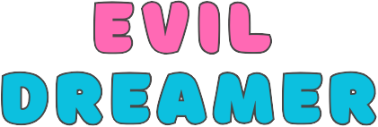
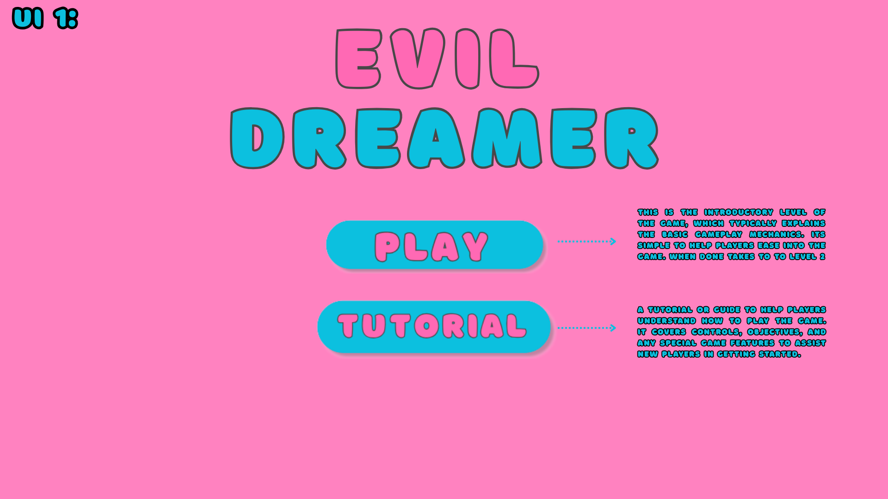
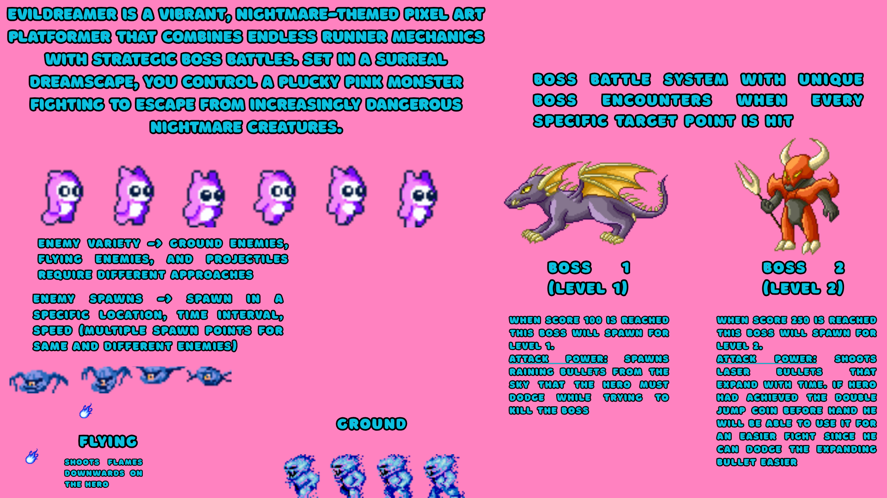
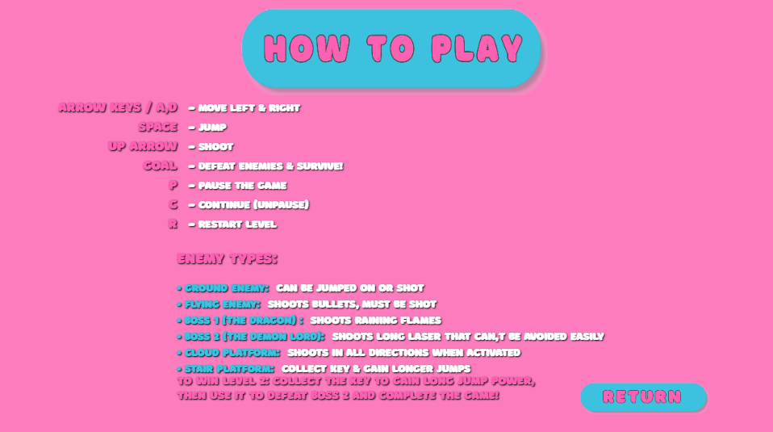

# 🎮 Evil Dreamer

<div align="center">



[](https://developer.mozilla.org/en-US/docs/Web/JavaScript)
[](https://developer.mozilla.org/en-US/docs/Web/HTML)
[](https://developer.mozilla.org/en-US/docs/Web/API/Canvas_API)

</div>

A modern 2D platformer game built with JavaScript and HTML5 Canvas. Control a pink monster through challenging levels, defeat enemies, and face epic boss battles.

## ✨ Features

- **🎮 Simple Controls**: Easy-to-learn keyboard controls for movement and combat
- **👾 Multiple Enemies**: Face ground enemies, flying enemies, and epic boss battles
- **💪 Power-Ups**: Collect keys to gain special abilities like long jumps
- **🎨 Beautiful Graphics**: Smooth animations and vibrant visuals
- **🎵 Immersive Audio**: Background music and sound effects for an engaging experience

## 🎮 Gameplay Screenshots

<div align="center">
  <!-- Main Menu -->
  <div style="display: flex; flex-direction: column; align-items: center;">
    <div style="flex: 2; padding: 10px;">
      <p><strong>Main Menu</strong></p>
      <div style="display: flex; gap: 10px;">
        
      </div>
    </div>
    <!-- Levels -->
    <div style="display: flex; align-items: flex-start; margin-top: 20px;">
      <div style="flex: 2; padding: 10px;">
        <p><strong>Levels Demon Lord - Dragon Battle</strong></p>
        <div style="display: flex; gap: 10px;">
           
        </div>
      </div>
    </div>
    <!-- Tutorial -->
    <div style="display: flex; align-items: flex-start; margin-top: 20px;">
      <div style="flex: 2; padding: 10px;">
        <p><strong>Tutorial</strong></p>
        <div style="display: flex; gap: 10px;">
          
        </div>
      </div>
    </div>
  </div>
</div>

## 🎯 Game Mechanics

The game features several key mechanics:

|      Movement      |        Combat         |      Power-Ups      |  Boss Battles   |
| :----------------: | :-------------------: | :-----------------: | :-------------: |
| **Arrow Keys/A,D** |   **Space to Jump**   | **Key Collection**  | **Dragon Boss** |
| **Space to Jump**  | **Up Arrow to Shoot** | **Long Jump Power** | **Demon Lord**  |

## 🚀 Getting Started

### Prerequisites

- Modern web browser (Chrome, Firefox, Edge, Safari)
- JavaScript enabled
- HTML5 Canvas support
- Audio support

### Installation

1. Clone the repository:

   ```bash
   git clone https://github.com/joewrdd/EvilDreamer.git
   ```

2. Navigate to the project directory:

   ```bash
   cd EvilDreamer
   ```

3. Open `index.html` in your web browser:
   ```bash
   open index.html
   ```

## 📦 Project Structure

```
EvilDreamer/
├── js/               # JavaScript source code
│   ├── game.js      # Core game engine
│   └── myCode.js    # Game logic and classes
├── public/          # Game assets
│   ├── audio/       # Sound effects and music
│   ├── background/  # Level backgrounds
│   ├── hero/        # Player character sprites
│   ├── enemy/       # Enemy sprites
│   ├── boss/        # Boss sprites
│   ├── theme/       # UI elements
│   ├── lives/       # Life indicators
│   ├── platforms/   # Platform sprites
│   └── collectibles/# Power-up sprites
└── index.html       # Main game file
```

## 🌟 Key Features Explained

### Combat System

The game features a dynamic combat system:

- Ground enemies can be defeated by jumping on them or shooting
- Flying enemies must be shot down
- Boss battles require strategic movement and timing
- Projectile system for ranged combat

### Level Design

Each level offers unique challenges:

- Level 1: Basic enemies leading to Dragon boss
- Level 2: Advanced enemies and key collection for power-ups
- Tutorial: Comprehensive guide to game mechanics

## 🙏 Acknowledgements

- HTML5 Canvas community for excellent documentation
- Game development community for inspiration and resources
- All contributors to the project

## 📄 License

This project is available under the MIT License - see the [LICENSE](LICENSE) file for details.

---

<div align="center">
  <p>Created With ❤️ by joewrdd</p>
</div>
